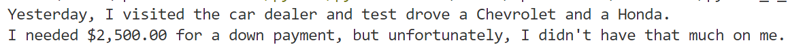

# Python: String & Numeric Variables Mastery Check

## Submitting Your Work

> - Create a new GitHub repo: ***string-numeric-variables-mc***
>
> - Use GitHub Desktop to upload your Python file to your repo
>
> - Submit the URL that points to your repo on Google Classroom

## What resources can I use?

- Previous Python projects
- The Internet
- Classroom textbooks

## General Requirements

- Show me what you know how to do (even if it's not the entire project)
- Always give me your best effort
- Always check your spelling, grammar and punctuation before submitting your work
- Add a comment block to the top of your script, like so:

```python
# Abraham Lincoln
# Current date
# Project title
```

## Getting Started

Write a script that:

- uses two string variables to tell me which two vehicles you test drove yesterday at the used car dealership, e.g., Chevrolet, Nissan, Ford, etc.
- uses a third variable to tell me how much of a down payment you made on the vehicle you decided to buy
    - Assign a float to your down payment variable (a float is a number with a decimal point)
- Use an [f-string](https://www.programiz.com/python-programming/string-interpolation#:~:text=f%2Dstrings,Python%20expressions%20inside%20string%20constants.) to build your output
- Include a dollar sign (**$**) in front of the number representing your down payment
 
## Sample Output


